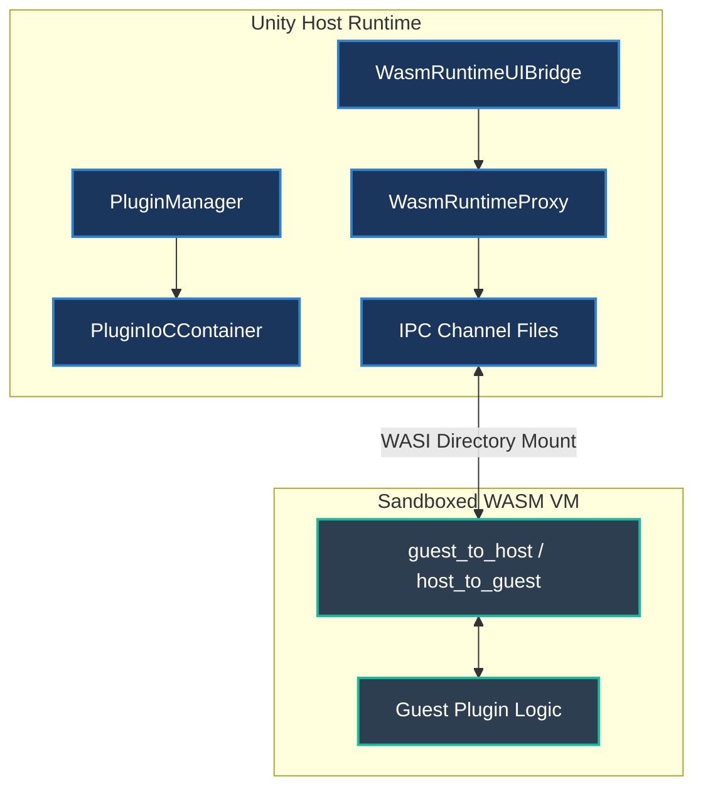

# Unity Runtime Plugin System Specification
**Version:** 1.3.0  
**Target Platform:** Unity 6+  
**WASM Runtime:** Wasmtime / Mono-WASM  

---

## 1. Overview
The UnityRuntimePlugins framework enables dynamic extension of Unity applications (Editor and Runtime) through decoupled, WASM-based plugin modules. Plugins are distributed as self-contained `.zip` archives containing assets, metadata, and compiled logic.

The system is designed for **extreme sandbox safety** and **compile-time decoupling**. Native assemblies inside plugins are compiled to WebAssembly (WASM), preventing direct memory access to the Host Unity environment while enabling bidirectional communication, inter-plugin calling, and dynamic UI binding.

---

## 2. How the Plugin System Works



This diagram visualizes the secure boundaries of our architecture. The **Unity Host Runtime** manages orchestration, service resolution, and UI binding via components like the `PluginManager`, `PluginIoCContainer`, and `WasmRuntimeUIBridge`. This host layer remains completely separated from the **Sandboxed WASM VM (Guest)** where the actual plugin code executes. They bridge the execution gap bidirectionally via the **IPC Channel** utilizing WASI directory mount mapping to write and poll sandboxed files, ensuring the guest never gains direct access to host memory.

### 2.1 The Execution Pipeline
1. **Dynamic Loading & Environment Selection**: `PluginManager` discovers and extracts `.zip` plugin modules, registering addressable prefabs and assets into Unity based on active runtimes (BatchMode/Server vs. Client/Standalone).
2. **Virtualization**: A `WasmRuntimeProxy` boots a Wasmtime Virtual Machine. It configures WASI (WebAssembly System Interface) directory mounts with preopened read/write permissions mapped to the module's sandboxed `streaming_assets` directory.
3. **Background IPC Polling Loop**: Because Mono-WASM runtimes operate in isolated virtual environments, they cannot call Unity's C# assembly directly. Bidirectional interop is driven by a concurrent, thread-safe background loop exchanging commands via two highly optimized sandboxed memory-mapped files:
   - `host_to_guest.txt`: Receives commands sent from Unity (UI clicks, values, custom commands).
   - `guest_to_host.txt`: Receives commands sent from the guest logic (UI updates, asset loads, cross-plugin call requests).
4. **Decoupled Inter-Plugin Invocations**: Plugins can invoke functions inside *other* completely separate plugins using a global **Inversion of Control (IoC) Container** (`PluginIoCContainer`). Each proxy registers itself on startup, allowing dynamic API resolution and pipe-delimited routing between guest runtimes.
5. **Type-Safe Serialized Dispatching**: In addition to simple string-based commands, developers can send strongly-typed commands serialized as JSON using `SendCommand<TCommand>`. A robust index-based split parser ensures nested braces or pipe characters inside the JSON strings do not corrupt command arguments.

---

## 3. Directory Hierarchy & Manifests

### 3.1 Plugin Archive Structure
```text
<Plugin-Archive>.zip/
└── <module-name>/
    ├── manifest.json           # Required: Module metadata
    ├── client/                 # Loaded if Application.isBatchMode == false
    │   ├── addressables/       # Addressable assets (prefabs, textures, audio)
    │   ├── streaming_assets/   # Compiled logic (.wasm) & mounted runtime files
    │   └── source_code~/       # C# source (tilde ignores it in Unity Editor compile)
    ├── server/                 # Loaded if Application.isBatchMode == true
    │   ├── addressables/
    │   ├── streaming_assets/
    │   └── source_code~/
    └── common/                 # Loaded in all environments
        ├── addressables/
        ├── streaming_assets/
        └── source_code~/
```

### 3.2 manifest.json Schema
```json
{
  "name": "string",             // Unique identifier for the module
  "version": "string",          // SemVer versioning (e.g. 1.0.0)
  "entryPoint": "string.wasm",  // Main logic binary located inside streaming_assets
  "dependencies": [],           // List of other module names required at boot
  "capabilities": []            // e.g., ["UI", "Network", "FileSystem"]
}
```

### 3.3 Non-GUI Addressables & Asset Access

Non-GUI Addressables are non-interface assets (such as `AudioClip`, `Texture2D`, `Material`, `TextAsset` configs, or gameplay `Prefab` models) packaged inside a module's `addressables/` or `streaming_assets/` directories. 

> [!IMPORTANT]
> **Unity Addressable Asset Requirements**:
> To be successfully resolved by the `PluginManager` asset pipeline, each Addressable asset must meet the following:
> 1. **Check the 'Addressable' Property**: The asset's **Addressable** checkbox must be checked at the top of its Unity Inspector window.
> 2. **Set a Unique Address Path**: The address path of the asset (e.g. `Sounds/Explosion.mp3`) must be defined inside the Addressable text input field and match the string key used during loading calls.
> 3. **Addressables Group Mapping**: The asset must reside in a dedicated group inside Unity's **Addressables Groups** window, ensuring it is compiled into the plugin's dynamic asset catalog.

#### 1. Adding Non-GUI Addressables
* **Addressables Folder**: Place assets directly into your module's `client/addressables/`, `server/addressables/`, or `common/addressables/` folders. During building, the Unity Editor compiles these into dynamic Addressables catalogs mapped to the unique module namespace.
* **Streaming Assets Folder**: For read-only text configs, binary data, or JSON schemas that the WASM guest needs to read directly, place them in `streaming_assets/`.

#### 2. Accessing Assets from Inside the WASM Guest (Plugin Code)
* **Direct File System Access (for `streaming_assets/` files)**:
  Because the host mounts the module's sandboxed filesystem under WASI permissions, your guest code can read data files directly using standard C# `System.IO` calls, bypassing IPC completely:
  ```csharp
  string configJson = File.ReadAllText("configs/settings.json");
  ```
* **IPC Request Access (for Addressable assets)**:
  Since the Guest VM cannot hold direct references to native Unity objects (`UnityEngine.Object`), it sends an IPC command requesting the Host to load and operate on the asset:
  ```csharp
  // Requesting Host to load and play an audio asset
  SendCommand("PLAY_AUDIO:Sounds/Explosion.mp3");
  ```

#### 3. Accessing Plugin Assets from the Unity Host (Outside the Plugin)
The main Unity application or other host systems can directly inspect and load assets belonging to a specific module using `IPluginServices`:
* **Querying Asset Paths**:
  ```csharp
  // Query all AudioClips loaded by a specific module
  IEnumerable<string> audioKeys = await pluginServices.GetAssetsByType<AudioClip>("AudioModule");
  ```
* **Loading Asset Instances**:
  ```csharp
  // Dynamically load the asset at the specified path
  AudioClip clip = await pluginServices.LoadAsset<AudioClip>("AudioModule", "Sounds/Explosion.mp3");
  ```

---

## 4. Services & Inter-Plugin Interop

### 4.1 IPluginServices Contract
The interface exposing Host APIs to client controllers:
```csharp
namespace UnityRuntimePlugins
{
    public interface IPluginServices
    {
        void InvokeWasmFunction(string moduleName, string functionName, params object[] args);
        void SendCommand<TCommand>(string moduleName, TCommand command) where TCommand : class;
        Task<IEnumerable<string>> GetAssetsByType<T>(string moduleName) where T : UnityEngine.Object;
    }
}
```

### 4.2 Decoupled Service Registry (IoC)
Plugins register themselves dynamically under the `ICallablePlugin` interface in the `PluginIoCContainer`:
```csharp
// Resolution
var target = PluginIoCContainer.Instance.Resolve<ICallablePlugin>("InventoryModule");
target?.InvokeFunction("AddItem", "Sword", "1");
```

### 4.3 Dynamic Unity API Callbacks (Reflection Router)

Guest WASM plugins can invoke **arbitrary Unity C# methods** on the Host dynamically without modifying host scripts, registering handlers, or holding binary dependencies. This is achieved using our thread-safe **Dynamic Reflection Router** executing safely on Unity's main thread.

#### 1. Calling Static Utility Methods
From your guest plugin code, call `CallUnityStatic(typeFullName, methodName, args...)`. This resolves the type across all loaded assemblies, finds the matching static method, converts string arguments to their target types, and executes it:
```csharp
// Invokes a static system logger or utility directly in Unity
CallUnityStatic("UnityEngine.Debug", "Log", "Hello from Guest VM reflection!");
```

#### 2. Calling Active Scene GameObject Component Methods
To invoke instance methods on a component attached to an active GameObject in your scene hierarchy, call `CallUnityInstance(gameObjectName, componentName, methodName, args...)`:
```csharp
// Invokes 'CustomMethod' on the 'PlayerController' component attached to the 'Hero' GameObject
CallUnityInstance("Hero", "PlayerController", "CustomMethod", "argVal1", "123");
```

---

## 5. UI Integration & Editor Custom Tooling

### 5.1 WasmRuntimeUIBridge
Links both **UI Toolkit (`UIDocument`)** and traditional **uGUI (Canvas-based panels)** seamlessly to the WASM Guest:
- **Edit-Time Callback Mapping**: A custom Unity Inspector parses your UXML layout and Canvas GameObjects for named interactive elements (`Button`, `TextField`, `Toggle`, `Slider`). It simultaneously scans the uncompiled `.cs` source code files inside your `source_code~/` directory for public C# methods.
- **Dropdown Binding**: Developers configure UI callback mappings directly inside the Inspector via dropdown lists. No linking scripts are required.
- **Runtime Execution**: Standard button clicks (`onClick` / `clicked`) and inputs automatically trigger the mapped WASM function dynamically with value parameters.

---

## 6. Step-by-Step Guide: Making a Plugin

This step-by-step tutorial walks you through creating a guest plugin named `CalculatorModule`, defining its C# logic, generating its UXML UI panel, and mapping their callbacks together in Unity.

### Step 0: Initialize your Development Environment

Before scaffolding your plugins, ensure your development machine has the required compiler toolchains and workload dependencies configured:
1. In the Unity top menu bar, select **Plugins > Initialize System**.
2. This runs an automated check verifying:
   * **.NET SDK**: Confirms if the .NET 8 SDK is installed on your OS.
   * **WASI-WASM Workload**: Automatically installs the C# WASM workload compiler (`dotnet workload install wasi-wasm`) if missing.
   * **Project Directories**: Automatically builds target folders (`Assets/PluginProjects/` and `Plugins/`) in your project if missing.
3. Once the initialization finishes, you will see a success dialog summarizing your setup!

### Step 1: Scaffold the Directory Structure

You can create the plugin structure using either our automated in-Editor tool or by creating directories manually:

#### Option A: Automated Project Generator (Recommended)
1. In the Unity Editor top menu, navigate to **Plugins > Project Generator**.
2. Set the **Plugin Name** to `CalculatorModule` and the **Module Name** to `CalculatorModule` (or any custom names).
3. Click **Generate Plugin Scaffold**.
4. The tool will automatically create a complete, ready-to-build project under `Assets/PluginProjects/CalculatorModule/` with:
   - A fully configured `manifest.json`.
   - Complete folder hierarchies (`client`, `server`, `common` containing `addressables`, `streaming_assets`, and `source_code~`).
   - A fully configured `.csproj` for WASM compilation.
   - A pre-written C# stub containing the communication loop, safe-exit protocol, and loggers.

#### Option B: Manual Scaffolding
1. Create a new directory named `CalculatorModule` inside `Assets/PluginProjects/` or a temporary folder.
2. Inside `CalculatorModule/`, create `manifest.json`:
   ```json
   {
     "name": "CalculatorModule",
     "version": "1.0.0",
     "entryPoint": "CalculatorModule.wasm",
     "dependencies": [],
     "capabilities": ["UI"]
   }
   ```
3. Create the directories:
   - `CalculatorModule/client/streaming_assets/` (where the compiled `.wasm` and dynamic IPC exchange text files are mounted).
   - `CalculatorModule/client/source_code~/` (where your C# uncompiled source files are placed).

### Step 2: Write the Guest C# Logic

Instead of writing complex file streams, polling loops, or custom pipe-delimited parser boilerplate, developers simply inherit from **`WasmPluginBase`**!

Create `CalculatorLogic.cs` inside `CalculatorModule/client/source_code~/`:

```csharp
using System;

public class CalculatorLogic : WasmPluginBase
{
    // The main entry point starts our background virtual execution loop
    public static void Main()
    {
        new CalculatorLogic().Run();
    }

    protected override void OnStart()
    {
        Log("Calculator logic active.");
    }

    // Handles incoming Host callbacks (like buttons clicks or input updates)
    protected override void OnCommandReceived(string commandName, string[] args)
    {
        if (commandName == "OnAddPressed")
        {
            TriggerAddition();
        }
    }

    private void TriggerAddition()
    {
        // Execute dynamic calculation logic
        int result = 50 + 100;

        // Use built-in base method to update a text component on the Host UI
        SetText("ResultText", $"Sum: {result}");
    }
}
```

### Step 3: Compile to WASM & Package
1. Use the **Plugin Builder** Editor tool in Unity:
   - Navigate to **Tools > Plugin Builder**.
   - Select your source directory (`CalculatorModule/`).
   - Click **Compile and Build WASM**.
   - This compiles `CalculatorLogic.cs` to a sandboxed `.wasm` binary using Mono-WASM and places the compiled `calculator.wasm` inside `CalculatorModule/client/streaming_assets/`.
   - The tool then packages the directory into `CalculatorModule.zip`.

### Step 4: Configure the UI Panel in Unity
We can use a Canvas layout:
1. In your Unity Hierarchy, create a **Canvas** panel.
2. Add a child UI Button and name the GameObject: `AddButton`.
3. Add a child Text component (TextMeshPro or standard Text) and name the GameObject: `ResultText`.
4. Attach a **`WasmRuntimeProxy`** component to `ClientTestPanel`:
   - Set `Module Name` = `CalculatorModule`
   - Set `Wasm File Name` = `calculator.wasm`
5. Attach a **`WasmRuntimeUIBridge`** component to `ClientTestPanel`:
   - Drag and drop your `WasmRuntimeProxy` component into the `Runtime Proxy` slot.

### Step 5: Map Callbacks inside the Inspector
1. Click **Scan UI & Plugin Source Code** inside the `WasmRuntimeUIBridge` component.
2. Click **Add New Callback Mapping**:
   - In the **UI Element** dropdown, select `AddButton`.
   - In the **Event Type** dropdown, select `clicked`.
   - In the **Plugin C# Method** dropdown, select `OnAddPressed`.
3. Click Play! Clicking the `AddButton` in your panel now triggers the `OnAddPressed` callback inside the sandboxed WASM plugin, updating `ResultText` with `"Sum: 150"`!

---

## 7. Writing Server Plugins

Server plugins run on **headless Unity Dedicated Servers** (where `Application.isBatchMode == true` in terminal environments like Linux cloud servers). They are identical in design and structure to client plugins but contain multiplayer authority logic, matchmaking rule engines, database connections, or state sync simulations.

### 7.1 Key Server Mappings & Features
* **No GUI Components**: Server modules have no UXML UI Toolkit layouts or Canvas GameObjects. They do not attach or require the `WasmRuntimeUIBridge` component.
* **Direct Scripted IPC / JSON Command routing**: Rather than using visual click bridges, the server environment routes networking packets or custom gameplay events to the guest module using `WasmRuntimeProxy.InvokeFunction(...)` or `SendCommand<TCommand>(...)` directly.
* **The Server Lifecycle Directory**:
  - Place your authority logic inside the `server/source_code~/` directory.
  - The `PluginManager` will automatically load and compile the WASM binary under the `server/` subdirectory when running in headless batch mode, keeping client-only assets and logic out of the server runtime bundle.

---

- **Decoupling**: No direct binary or assembly references from host code to guest plugin assemblies are permitted. All communications must remain decoupled and sandboxed.
- **Sandboxing**: WASM modules cannot access host memory directly except through mounted, preopened sandboxed folders mapped in `WasmRuntimeProxy`.
- **Platform Agnostic**: Plugins must function across Windows, Mac, and Linux environments without requiring target platform recompilations.

---

## 9. Multi-Platform Deployment Guide

Deploying WASM plugins requires understanding how different target platforms handle sandboxing, dynamic library runtimes, and local file access permissions.

### 9.1 General Deployment Concept
All build architectures locate plugins as **ZIP archives** (e.g. `InventoryModule.zip`) placed inside a target source directory. During runtime initialization, the `PluginManager` extracts these archives into a writable extraction directory (`Application.persistentDataPath + "/ExtractedPlugins/"`), mounts filesystems, and starts execution.

---

### 9.2 Windows Deployment (Standalone PC)
* **Target Environment**: Standard 64-bit Windows systems.
* **Native Runtime Setup**: Ensure the Windows native `wasmtime` engine library (`wasmtime.dll`) is included under the package’s `Runtime/Plugins/x86_x64/` directory.
* **Directory Locations**:
  * **Streaming Assets (Read-Only Source)**: `[BuildPath]/[AppName]_Data/StreamingAssets/Plugins/`
  * **Persistent Storage (Extracted Target)**: `C:\Users\[Username]\AppData\LocalLow\[CompanyName]\[ProductName]\Plugins\`
* **Execution details**: No elevated permissions are required. Wasmtime runs safely within standard user privilege environments.

---

### 9.3 macOS Deployment (Standalone Mac)
* **Target Environment**: Apple Silicon (`arm64`) & Intel (`x86_64`) macOS.
* **Native Runtime Setup**: Ensure both `libwasmtime.dylib` (Intel) and `libwasmtime_arm.dylib` (Apple Silicon) are compiled and present in the dynamic framework paths.
* **App Sandboxing & Entitlements (App Store / Notarization)**:
  > [!IMPORTANT]
  > macOS builds compiled under Apple App Sandbox restrictions must explicitly declare the following entitlements in their `entitlements.plist` file:
  > * `com.apple.security.files.user-selected.read-write` (allows reading and writing plugin streams).
  > * `com.apple.security.network.client` (required if guest modules route IPC via TCP sockets instead of file streams).
* **Directory Locations**:
  * **Streaming Assets (Read-Only Source)**: `[AppName].app/Contents/Resources/Data/StreamingAssets/Plugins/`
  * **Persistent Storage (Extracted Target)**: `/Users/[Username]/Library/Application Support/[CompanyName]/[ProductName]/Plugins/`

---

### 9.4 Linux Deployment (Standalone Linux / Headless Dedicated Servers)
* **Target Environment**: Standard Linux distributions, cloud virtual machines, multiplayer game servers.
* **Native Runtime Setup**: Ensure the Linux native `libwasmtime.so` engine library is correctly included and verified in Unity's Platform inspector settings.
* **Directory Locations**:
  * **Game Clients**: `[BuildPath]/[AppName]_Data/StreamingAssets/Plugins/`
  * **Headless Server (Command Line / Batch Mode)**: Create a standalone `Plugins/` folder in the same root folder as the executable binary:
    `./Plugins/ServerAuthorityModule.zip`
* **File Permissions**:
  > [!WARNING]
  > Headless Linux servers must have proper filesystem read/write privileges configured. Ensure the executing shell user has standard permissions to create and modify folders inside the extraction path:
  > `chmod -R +rw ./Plugins/`

---

### 9.5 Web Deployment (WebGL Browser)
* **Target Environment**: HTML5 / WebGL browser runtimes.
* **Runtime Restrictions**:
  > [!CAUTION]
  > Standalone WASM runtimes (like Wasmtime) rely on native C/C++ dynamic libraries (`.dll`, `.dylib`, `.so`) and background polling threads, which are **not supported in standard WebGL browser sandboxes** due to security restrictions and single-threaded JavaScript execution loops.
* **WebGL Fallback Architecture**:
  1. **Compiling Guest Plugins to Native JS WASM**: Instead of running a Wasmtime VM instance inside WebGL, compile your guest C# plugin directly using Unity's native WebGL builder (which compiles the entire game to WebAssembly) or deploy it as a standalone browser WASM file.
  2. **Browser JS-WASM Interop**: In WebGL environments, the `WasmRuntimeProxy` bypasses file-based text IPC and implements communication using standard browser WebAssembly instantiate APIs (`WebAssembly.instantiate()`) and JavaScript-to-Unity message routines (`JSLib` / `SendMessage`).