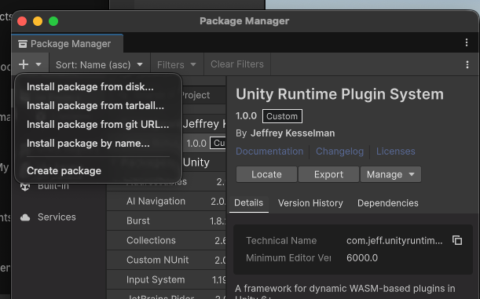

# Unity WASM Runtime Plugin System

A high-performance, secure, and fully sandboxed **.NET WebAssembly (WASM) Plugin System** built for **Unity 6**. It allows developers to build, load, compile, and execute sandboxed guest C# plugins dynamically at runtime across both visual client applications and headless dedicated servers.

> [!IMPORTANT]
> Although this system is designed to work over Windows, Mac, Linux, and WASM, it is currently being developed on a Mac. No compatibility with other platforms is assured until the 1.0 release.

---

## 📦 Installation

### Option A: Install Package from Disk (Recommended for active package editing)
The core package files are located at: `Packages/com.jeff.unityruntimeplugins`

1. Open the **Package Manager** in Unity (**Window > Package Manager**).
2. Click the **`+`** icon in the top-left corner of the window.
3. Select **Add package from disk...**
4. Navigate to `Packages/com.jeff.unityruntimeplugins/`, select the `package.json` file, and click **Open**.

### Option B: Install Package from Tarball (Recommended for stable standalone distribution)
We provide a pre-packaged tarball at the root of this repository: `com.jeff.unityruntimeplugins-1.0.0.tgz`

1. Open the **Package Manager** in Unity (**Window > Package Manager**).
2. Click the **`+`** icon in the top-left corner of the window.
3. Select **Add package from tarball...**
4. Navigate to and select `com.jeff.unityruntimeplugins-1.0.0.tgz`, and click **Open**.

---

## 🚀 Key Features

* **Thread-Safe Inversion of Control (IoC) Container**: Register and resolve plugins dynamically across guest modules via our locator (`PluginIoCContainer`) for seamless cross-plugin communication.
* **Zero-Boilerplate Base Class (`WasmPluginBase`)**: Guest C# code inherits from a base helper class that hides file-based IPC polling, lock delays, and safe acknowledgments. Focus on purely your business logic in under 20 lines!
* **Dynamic Reflection API Router (`CALL_UNITY`)**: Guest WASM plugins can invoke *any* static or instance C# method inside Unity's host assembly dynamically (converting argument types on-the-fly) without binary dependencies.
* **Dual-UI Mapping Inspector (`WasmRuntimeUIBridge`)**: Graphically bind events from both **UI Toolkit (`UIDocument`)** and traditional **uGUI (Canvas panels)** elements to C# guest methods with one-click dropdown selectors.
* **Type-Safe Command Dispatching**: Dispatch strongly-typed commands serialized as JSON using `SendCommand<T>`. Arguments remain completely safe from pipe truncations.
* **Automatic Scaffold Generator**: Generate clean, ready-to-compile WASM plugin templates (containing configured `.csproj` files, base classes, and stubs) with a single click.
* **Dedicated Server Support**: Automatically isolates execution for dedicated servers in batch mode, routing gameplay logic and network packets without visual overhead.

---

## 📚 Documentation Links

Detailed design specifications, execution lifecycles, and step-by-step developer tutorials are available below:

* 📄 <a href="./Docs/plugin%20system%20design%20v1.1.md" target="_blank">**Unity WASM Plugin Specification & Step-by-Step Developer Guide (v1.1)**</a>
  * *Covers: Execution pipelines, Mermaid flow diagrams, and a 5-step guide for creating, building, and running a plugin from scratch.*
* 📄 <a href="./Docs/plugin%20system%20design" target="_blank">**Legacy Design Specification Document**</a>
  * *Original design draft and core conceptual notes.*

---

## 🛠️ Getting Started in 4 Steps

1. **Initialize the System**: In the Unity top menu bar, select **Plugins > Initialize System**. This runs an automated check confirming your .NET 8 SDK installation, installs the required `wasi-wasm` compiler workload, and configures core target directories.
2. **Scaffold a Project**: Navigate to **Plugins > Project Generator** to create a fresh stub module under `Assets/PluginProjects/`.
3. **Build the WASM Binary**: Open **Tools > Plugin Builder**, select your plugin, and click **Compile and Build WASM** to output the packaged zip module.
4. **Bind UI Elements**: Attach a `WasmRuntimeProxy` and a `WasmRuntimeUIBridge` to your canvas UI panel, click **Scan UI & Plugin Source Code**, map your button clicks to your plugin's C# methods, and press Play!

